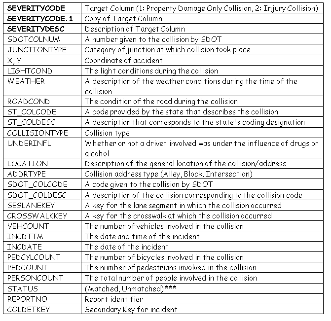
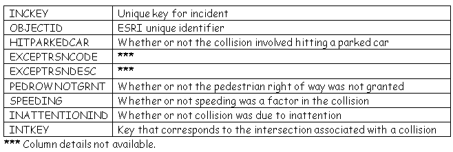

# CAR ACCIDENT SEVERITY REPORT

it is used for IBM datascience capstone project

# Introduction | Business Understanding
 
* Road traffic injuries are currently estimated to be the eighth leading cause of death across all age groups globally, and are predicted to become the seventh leading cause of death by 2030.

* Analysing a significant range of factors, including weather conditions, special events, roadworks, traffic jams among others, an accurate prediction of the severity of the accidents can be performed.

* In an effort to reduce the frequency of car collisions in a community, an algorithm must be developed to predict the severity of an accident given the current weather, road and visibility conditions. In an application, Knowing the severity of any such collision beforehand will lead to prevention and prompt action.
# Problem

Data that might contribute to determining the likeliness of a potential accident occurring might include information on previous accidents such as road
conditions, weather conditions, exact time and place of the accident, type of vehicles involved in the accident, information on the users involved in the accident
and off course the severity of the accident. This projects aims to forecast the severity of accidents with previous information that could be given by a witness
informing the emergency services.

# Interest

Governments should be highly interested in accurate predictions of the severity of an accident, in order to reduce the time of arrival and to make a more efficient
use of the resources, and thus save a significant amount of people each year. Others interested could be private companies investing in technologies aiming
to improve road safeness.

# Data

The data can be found in the following Kaggle data set.link: https://www.kaggle.com/ahmedlahlou/accidents-in-france-from-2005-to-2016                                          
A comprehensive dataset of 226,000 accidents occurring upto 2014, which was provided by Seattle Police Department and recorded by traffic records is used. The 226,000 row dataset has 40 columns describing the details of each accident including the weather conditions, collision type, date/time of accident and location (latitude and longitude).
the data provided consists of following features:

## Data Understanding

Our predictor or target variable will be 'SEVERITYCODE' because it is used to measure the severity of an accident from 0 to 4 within the dataset. Attributes used to weigh the severity of an accident are 'WEATHER', 'ROADCOND' and 'LIGHTCOND'.

Severity codes are as follows:
* 0 : Little to no Probability (Clear Conditions)
* 1 : Very Low Probability - Chance or Property Damage
* 2 : Low Probability - Chance of Injury
* 3 : Mild Probability - Chance of Serious Injury
* 4 : High Probability - Chance of Fatality

Most of our data columns are categorical and we need to know that how affect the severity of the accident.                                                                 
There are low cardinality categorical variables with 6–7 categories, moderate cardinality categorical variables with 40–70 categories and very high cardinality categorical variable with 1500+ categories.

## Feature engineering:                                                                                                                                                     
'INTKEY', 'EXCEPTRSNCODE', 'EXCEPTRSNDESC', 'INATTENTIONIND','PEDROWNOTGRNT'-These features have high percentage of missing values so drop them
Mostly all the variables (except the features which defines the number of people, vehicles etc.) are nominal features; i.e., features where the categories are only labelled without any order of precedence. Preferred encoding for these categories is One-Hot encoding. However, One-Hot encoding will generate around 1500 data columns for just one high cardinality categorical variable, which will be very expensive to work with.
so Remove the categorical features which accounts for less than 1% of total data by this the no of columns of our data decreses to 118 colummns and we are ready to train the model
### Balancing the Dataset:
Our target variable SEVERITYCODE is only 42% balanced. In fact, severitycode in class 1 is nearly three times the size of class 2.
We can fix this by downsampling the majority class or upsampling the minority class.
##### Down-sample Majority Class
Down-sampling involves randomly removing observations from the majority class to prevent its signal from dominating the learning algorithm.

The most common heuristic for doing so is resampling without replacement.

The process is similar to that of up-sampling. Here are the steps:

* 1.First, we'll separate observations from each class into different DataFrames.
* 2.Next, we'll resample the majority class without replacement, setting the number of samples to match that of the minority class.
* 3.Finally, we'll combine the down-sampled majority class DataFrame with the original minority class DataFrame.

##Apply Feauture selection:
first, I used the Lasso Regression model, and I select a suitable alpha (equivalent of penalty) value.The bigger the alpha the less features that will be selected.
Then I use the selectFromModel object from sklearn, which will select the features which coefficients are non-zero.

#Methodology 
Our data is now ready to be fed into machine learning models.

We will use the following models:

####Decision Tree
A decision tree model gives us a layout of all possible outcomes so we can fully analyze the consequences of a decision. It context, the decision tree observes all possible outcomes of different weather conditions.

####Logistic Regression
Because our dataset only provides us with two severity code outcomes, our model will only predict one of those two classes. This makes our data binary, which is perfect to use with logistic regression.

####Random Forest:
To go a bit further I will develop a Random Forest model. A random forest fits a number of **decision tree** classifiers on various sub-samples of the dataset and uses averaging to improve the predictive accuracy and control over-fitting. The number of decision trees is specified with the `n_estimators` parameter.\
An upside of this algorithm is its `feature_importances_` atribut, it returns the impurity based feature importance.

####XG Boost:
We used the XG Boost Classifier to start with and plotted the learning curve to see if the model is overfitting the training data. We observed that converged training and validation error were close to each other, which means that we can use high variance algorithms like Random Forest, XG Boost  and but I did feature selection in order to reduce complexity but if feature selection is not done accuarcy may get higher

# 7. Results:
Accuracy of the 4 models is calculated using these metrics: Jaccard Similarity Score and F1-SCORE.The results of different models are shown below:  
    
|**Algorithm**|**Jaccard**|**f1-score**|
|---------|-------|--------|
|**Decision Tree**|  0.695 | 0.691 |
|**Logistic Regression**| 0.69 | 0.69 | 
|**Random Forest**| 0.702  | 0.70 | 
|**XGboost**| 0.696  | 0.692 | 

 In my view *Logistic Regression* is the best model for this project, because it is fast, less complex and yet gives results close to ensembling models like Random forest and XGboost.
 
 ## Discussion:
 In the beginning of this notebook, we had categorical data that was of type 'object'. This is not a data type that we could have fed through an algorithm, so label encoding was used to created new classes that were of type int8; a numerical data type.                                                                                                 
After solving that issue we were presented with another - imbalanced data. As mentioned earlier, class 1 was nearly three times larger than class 2. The solution to this was downsampling the majority class with sklearn's resample tool. We downsampled to match the minority class exactly with 58188 values each.
Once we analyzed and cleaned the data, it was then fed through three ML models; Random Forest, Decision Tree,XG Boost and Logistic Regression. Although the first two are ideal for this project, logistic regression made the most sense because of its binary nature.
Evaluation metrics used to test the accuracy of our models were jaccard index, f-1 score and logloss for logistic regression. Choosing different max depth and hyperamater C values helped to improve our accuracy to be the best possible for different ML models.

## Conclusion:
##### In this study, I analyzed the relationship between severity of an accident and some characteristics which describe the situation that involved the accident. I identified the road condition,climate,lightning among the most important features that affect to the gravity of the accident. I built and compared 4 different classification models to predict whether an accident would have a high or low severity. These models can have multiple application in real life such as, Severity of a accident can be predicted in real time by using above data when an accident is reported and from there measures can be taken quickly.

